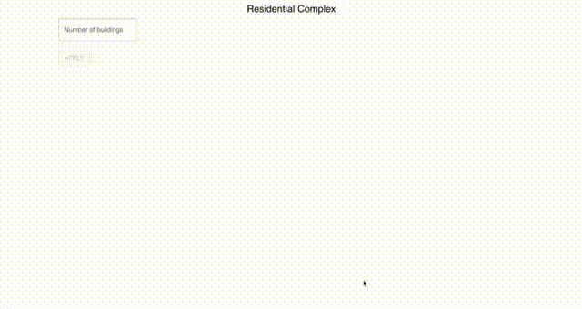
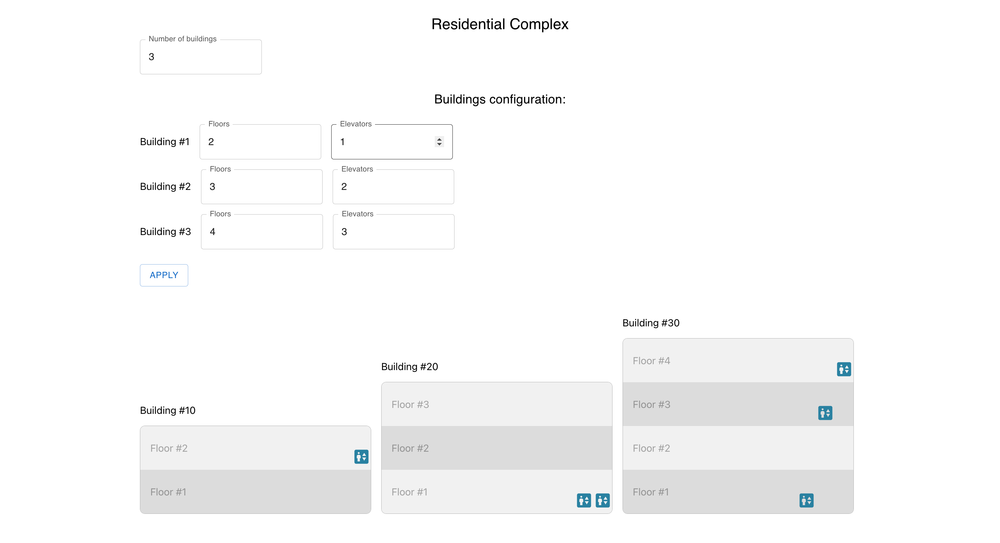

## Elevators Task

### Demo:


Screenshot:


### Start the project

```
npm start
```

Open [http://localhost:3000](http://localhost:3000) to view it in the browser.

### Run tests

```
npm test
```

Launches the test runner in the interactive watch mode.\
See the section about [running tests](https://facebook.github.io/create-react-app/docs/running-tests) for more information.

### Build the project

```
npm run build
```

## Used tech stack / libs:

- ESLint & Prettier
- Zustand as a store management (used it the first time)
- MUI as component library
- react-hook-form for form
- Yup for validation